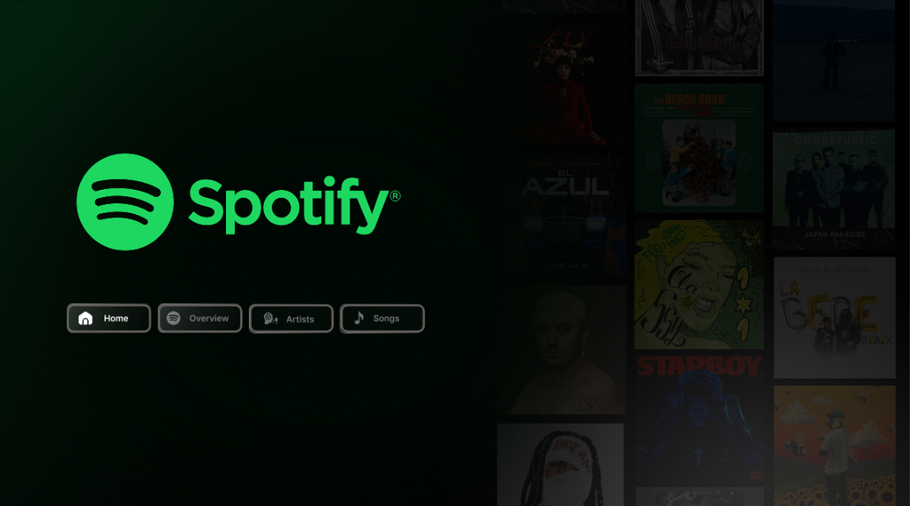
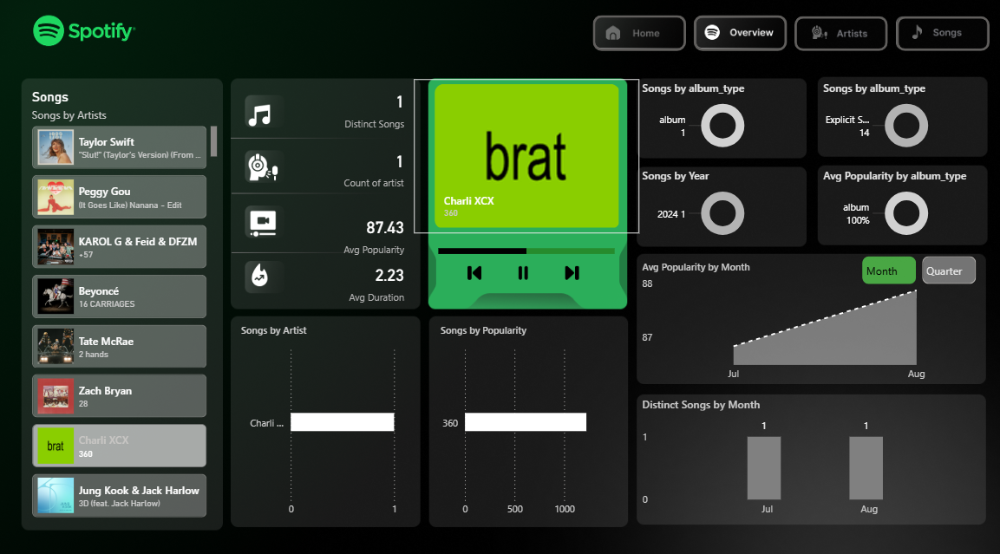
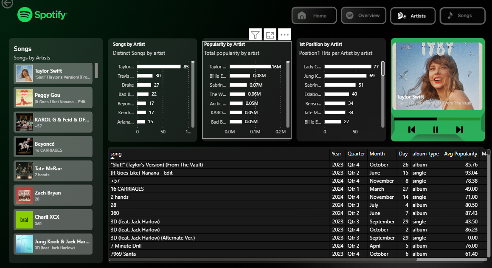
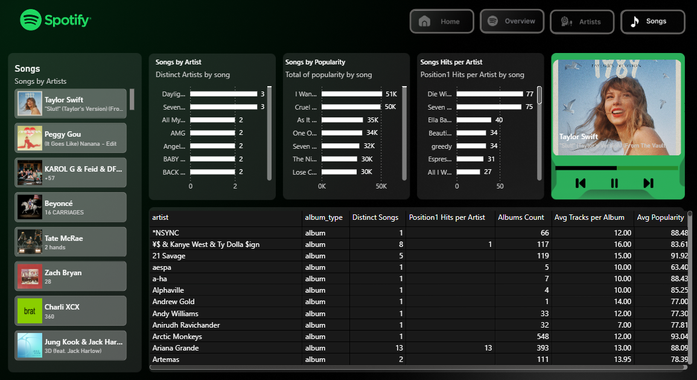

# Spotify Analytics Dashboard 🎵

An interactive Spotify Analytics Dashboard built using Microsoft Power BI.  
This project provides insights into songs, artists, popularity, album types, and streaming trends through visually appealing and interactive dashboards.

---

## 📌 Project Overview

The Spotify Dashboard helps users analyze:

- 🎤 Top artists and songs
- 📈 Song popularity trends
- 💿 Album type distribution
- 🔥 Explicit vs non-explicit songs
- 📅 Monthly and yearly music trends
- 📊 Artist performance metrics

The dashboard is designed with a modern Spotify-inspired UI using dark theme aesthetics and interactive navigation buttons.

---

## 📊 Dashboard Pages

### 🏠 Home Page

- Spotify-themed landing page
- Interactive navigation buttons
- Modern dark UI with premium visuals

### 📈 Overview Page

- Distinct songs count
- Artist count
- Average popularity & duration
- Album type analysis
- Popularity trends by month/year

### 🎤 Artists Page

- Top artists by popularity
- Artist hit analysis
- Songs per artist
- Detailed artist insights

### 🎶 Songs Page

- Song popularity analysis
- Top-performing songs
- Album-based categorization
- Detailed songs analysis

---

## 🛠 Tools & Technologies Used

- Microsoft Power BI
- DAX (Data Analysis Expressions)
- Power Query
- Data Visualization
- Dashboard UI/UX Design

---

## 📂 Dataset Information

The dataset contains:

- Song Names
- Artist Names
- Popularity Scores
- Album Types
- Release Dates
- Explicit Content Information
- Track Duration

---

## ✨ Features

✔ Interactive navigation buttons  
✔ Dynamic filtering and slicers  
✔ Spotify-inspired dark UI  
✔ KPI cards and charts  
✔ Responsive visual layout  
✔ Drill-through analysis  
✔ Trend visualization  
✔ Artist & song insights  

---

# 📸 Dashboard Preview

## 🏠 Home Dashboard



Spotify-inspired landing page with premium dark UI and navigation controls.

---

## 📈 Overview Dashboard



Overview dashboard displaying KPI cards, popularity analysis, and music trends.

---

## 🎤 Artists Dashboard



Artist analytics dashboard featuring artist popularity insights and performance tracking.

---

## 🎶 Songs Dashboard



Songs analysis dashboard showing top-performing songs and album-based statistics.

---

## 🚀 How to Use

1. Download the `.pbix` file  
2. Open it in Microsoft Power BI Desktop  
3. Refresh dataset if required  
4. Explore dashboard pages interactively  

---

## 📁 Project Structure

```bash
spotify-powerbi-dashboard/
│
├── Spotify_dashboard.pbix
├── README.md
│
├── screenshots/
│   ├── home-dashboard.png
│   ├── overview-dashboard.png
│   ├── artists-dashboard.png
│   └── songs-dashboard.png
│
└── dataset/
    └── spotify_data.csv
```

---

## 📌 Future Improvements

- Spotify API integration
- Playlist analytics
- Genre-based insights
- Real-time music trends
- Mobile responsive layout

---

## 👩‍💻 Author

### Nancy Dua

B.Tech CSE (IBM Specialization in Data Analytics)

### 🔗 Connect With Me

- LinkedIn: www.linkedin.com/in/nancy-dua
- GitHub: https://github.com/Nancydua11

---

## ⭐ Support

If you like this project, give it a ⭐ on GitHub!

---

## 🏷 GitHub Topics

```text
powerbi
spotify-dashboard
dashboard
data-analysis
business-intelligence
analytics
data-visualization
spotify
dax
music-analytics
```

---

## 📜 License

This project is licensed under the MIT License.

